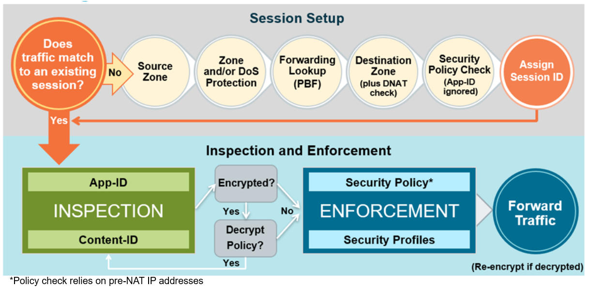

# PCNSE Study Notes

## Info

### PCNSE Exam Overview

- 80 Minutes
- 75 Questions
- Exam cover Palo Alto Networks firewalls and related technologies

### Resources

- Web-search for "Palo Alto Network PCNSE 8 Study Guide"
- LMS: <http://education.paloaltonetworks.com/learningcenter>
- Education Course:
  - EDU-110/210: Essentials
  - EDU-120/220: Managing Multiple Firewalls
  - EDU-330: Troubleshooting
- Practice Exams, learning assessments, and ACE certification
- Practice Lab

### Suggestions

- Focus on the firewall
- Know the Security Operating Platform "story"
- Understand default behaviors
- Know what policy rules look like in the CLI
- Questions test understanding, not memorization

### Topics of Interest

- Firewall Features
  - Security Profiles
  - Decryption
  - HA
  - Global Protect
  - Site-to-site VPN
  - App-ID
  - User-ID
  - Zone and DoS Protection
  - Log Forwarding
  - Policies
  - QoS

### Additional Topics of Interest

- Architecture
  - Management Plane
  - Data Plane
  - Single Pass Architecture (SPA)
- Processes and Procedures
  - Installing Licenses
  - Upgrades
- Panorama
  - Templates
  - Device Groups
  - Logging and Reporting

### Top Challenging Topics

- Administrative roles
- Authentication methodologies
- AutoFocus integration
- MFA entablement and use
- Wildfire concepts

## Firewall 9.0 Essentials: Configuration and Management (EDU-110)

### Firewall 9.0: Overview

#### Training Objective

- Use network segmentation to reduce your attack surface
- Use App-ID to determine application usage
- Use Content-ID to reduce your attack surface
- Use WildFire to reduce the number of zero-day attacks
- Use User-ID to determine who is accessing the internet
- Use firewall logs to recognize threats
- Use best practice configuration to successfully block malware

#### Module Learning Objectives

1. Security Operating Platform and Architecture
    - Describe the characteristics of the Security Operating Platform
    - Describe the single-pass architecture
    - Describe the Zero Trust security model and how it relates to traffic moving through your network
2. Initial Configuration
    - Connect to the firewall and log in as admin
    - Configure the network settings for the management interface port
    - Describe the differences between the running config and candidate config
    - Configure dynamic firewall updates to update the applications and threats databases
    - Create a local firewall administrative account
    - Access the firewall logs
3. Interface configuration
    - Describe the flow logic of the next-generation firewall
    - Create a security zone
    - Describe the differences between Tap, Virtual Wire, Layer 2, and Layer 3 interfaces
    - Create and configure a virtual router
    - Define a static default route
    - Configure a VLAN interface
    - Configure a loopback interface
4. Security and NAT Policies
    - Display and manage security policy rules
    - Describe the differences between implicit and explicit rules
    - Create a Security Policy
    - Describe the differences between source and destination NAT
    - Configure NAT
    - Configure destination NAT port forwarding
5. App-ID
    - Define application identification
    - Describe the four major technologies to help identify applications
    - Configure application filters and application groups
    - Detect unidentified applications traversing the firewall
    - Configure scheduling of updates to App-ID
6. Content-ID
    - Describe the seven different Security Profiles types
    - Define the two predefined Vulnerability Protection Profiles
    - Configure Security Profiles to prevent virus and spyware infiltration
    - Configure File Blocking Profiles to identify and control the flow of file types through the firewall
    - Configure a DoS Profile to help mitigate Layer 3 and 4 protocol-based attacks
7. URL Filtering
    - Describe how the firewall uses the PAN_DB database to filter user access to websites
    - Configure a custom URL Filtering Profile to minimize the number of blocked websites between trusted zones
    - Configure safe search and logging options
    - Configure access to only enterprise versions of SaaS applications
8. Decryption
    - Describe the benefits of decrypting traffic
    - Define the three decryption types that can be configured at the firewall
    - Describe how a certificate chain of trust is used to authenticate a device, service, or person
    - Configure an SSL Forward Proxy policy
    - Review Traffic logs to determine whether SSL sessions are being decrypted
9. WildFire
    - Describe how a firewall works with the WildFire Threat Intelligence Cloud
    - Describe how WildFire analysis is used to update URL categories listed in the PAN_DB URL Filtering database
    - Configure Session Information Settings to specify which type of information will be sent to WildFire
    - Define a WildFire Analysis Profile
    - Configure the types of information submitted to WildFire and the amount of information returned to the firewall in the report
10. User-ID
    - Describe the four main components of User-ID
    - Describe the differences between the integrated agent and the Windows-based agent
    - Define the methods to map IP addresses to users
    - Configure the PAN-OS integrated agent to connect to monitored services
    - Configure the Windows-based agent to probe IP addresses for username information
11. GlobalProtect
    - Describe the three major components of GlobalProtect
    - Configure the client and server certificates to authenticate the agent and the portal
    - Define the three methods supported for GlobalProtect client connections
    - Configure the tunnel parameters for an external gateway connection
12. Site-to-Site VPNs
    - Describe the three basic requirements for creating a VPN
    - Configure the interface, IP addresses, and PSK for the IKE Gateway
    - Configure the DH group, encryption methods, and authentication methods for an IKE Cryptographic Profile
    - Configure a static route in the route table to the tunnel
    - Troubleshoot your IPsec VPN issues from the responder side of the VPN tunnel
13. Monitoring and Reporting
    - Create an interactive, graphical summary of the applications with the ACC
    - Export policy rules, objects, and IPS signatures using the configuration table export
    - Create a predefined report to view traffic statistics for the previous day.
    - Describe how log files are forwarded to and external source
    - Configure a Server Profile to forward logs to a syslog server
14. Active/Passive High Availability
    - Describe the differences between active/active and active/passive HA
    - Define the prerequisites for creating an HA pair
    - Describe the metrics used to detect a firewall failure
    - Configure the firewall interfaces used for heartbeats and hellos
    - Configure an HA pair
15. Next-Generation Security Practices
    - Describe the migration process when moving from port-based firewall policies to application based firewall policies
    - Use Application Command Center, or ACC, to view trends in network activity
    - Define actions to take for optimizing Security Profiles
    - Describe the benefits and differences between the Heatmap and BPA reports

### Firewall 9.0: Security Operating Platform and Architecture

#### Training Objectives

- Describe the characteristics of the Security Operating Platform
- Describe the differences between single-pass architecture and parallel processing
- Describe the Zero Trust security model and how it relates to traffic moving through your network

#### Security Platform Overview

- Cyber Attack Lifecycle
  - The Cyber-Attack Lifecycle is a sequence of events that an attacker goes through to infiltrate a network and exfiltrate data from it.
  - Lifecycle

    | Stage | Description |
    | :------------- | :------------- |
    | Reconnaissance | Attackers carefully research, Identify, and select targets, often using phishing tactics or extracting public information from LinkedIn profiles, or from cooperate websites. These criminals can also scan for network vulnerabilities and services or applications that they can exploit     |
    | Weaponization | The attacker determines which methods to use in order to deliver malicious payloads. |
    | Delivery | They may choose to embed intruder code within seemingly innocuous files. Or, attackers may craft deliverables to attract the specific interests of an individual. |
    | Exploitation | An attacker now deploys an exploit against a venerable application or system. Deploying an exploit allows the attack to gain initial entry point into the organization. |
    | Installation | Attacker will seek to establish privileged, operations, such as maintaining access, persistence, and escalating privileges. |
    | Command and Control | Attackers establish a command channel back through the internet to a specific server so that they can communicate and pass data back and forth between infected devices and their own infrastructure |
    | Act on the Object | Now that an attacker has communication, they will act upon motivations to achieve their goal. Their motivation could be data exfiltration, destruction of critical infrastructure, to deface web property, or to create fear or the means for extortion. |

- Palo Alto Networks Security
  - Prevention-Focused
    - React-only to the critically important threat
  - Highly Automated
    - Reduce or remove manual response
  - Safely enables all applications
    - Granular use of controllers and prevention of known and unknown cyber threats
- Security Operating System
  - Cortex
    - Cortex Data Lake
    - Cortex XDR
      - Apps can be created and developed on a common application framework (Cortex) to rapidly build and deliver cloud-based security services with no additional infrastructure or on-premises hardware changes. Apps are delivered from the cloud to extend the capabilities of the platform, including the ability to effortlessly collaborate between different apps, share threat context, and intelligence, and drive automated response and enforcement.
- Network Security
  - Palo Alto Network Security Operating Platform firewalls are designed to safely enable applications and prevent modern threats. The firewall can identify all network traffic based on applications, user, content, and devices, and lets you express your business policies in the form of easy-to-understand security rules.
- Advanced Endpoint Protection
  - Traps Advanced Endpoint Protection provided multi-method prevention, a proprietary combination of malware and exploit prevention methods that preemptively block both known and unknown threats directly on the endpoint.
- Cloud Security
  - The Palo Alto Networks VM_Series firewall is a virtualized form of the Palo Alto Networks Security Operating Platform firewall. The VM-Series   firewalls are designed for use in a virtualized or cloud environment to identify all network traffic based on applications, users, content, and devices.
- Additional Palo Alto Networks Products
  - Panorama
  - Aperture
  - GlobalProtect
  - AutoFocus
  - MindMeld

#### Next-Generation Firewall Architecture

- Palo Alto Networks Single-Pass Architecture
  - Traditional Firewalls
    - Identify applications only by protocol and port number
  - Palo Alto Firewalls uses packet inspection and a library of applications signatures to
    - Distinguish between applications, that have the same protocol and port
    - Identify potentially malicious applications that use non-standard ports
  - Single Pass:
    - Operations per packet
    - One single policy (per type)

    | Name     | Responsibility     | Additional info |
    | :------------- | :------------- | :------------- |
    | Policy Engine       |        |
    | Content-ID | Data Filtering | Content scanning: threats, URLS, confidential Data |
    | | URL Filtering |
    | | Real-time Threat Prevention |
    | App-ID | Application Protocol Decoding | Traffic classification with APp-ID technology |
    | | Application Protocol Detection and Decryption|
    | | Application Signatures|
    | | Heuristics |
    | User-ID | | User or group mapping |
    | L2/L3 Networking, HA, Config Management, Reporting | |

    - Parallel Processing:
      - Function-specific parallel processing hardware engines
      - Separate data and control planes
  - Palo Alto Networks Firewall Architecture

    | Plane     | Function     | Incite |
    | :------------- | :------------- | :------------- |
    | Control Plane     | Management       | configuration - logging - reporting |
    | Data Plane | Signature Matching | exploits - virus - spyware - CC# - SSN |
    | | Security Processing | App-ID - User-ID - URL match - policy match - SSL/IPsec - decompression |
    | | Network Processing | flow control - MAC lookup - route lookup - QoS - NAT

#### Zero Trust Security Model

- Data flows in and Open Network
  
  | Name     | Description     | Additional Detail |
  | :------------- | :------------- | :------------- |
  | Lack of Visibility       | Internet       | If IT and Network security teams have no true visibility, they cannot control the users and applications traversing the network. The lack of full visibility means that organizations are vulnerable to attacks from both within the organization and from the public internet. |
  | North-South Traffic | Traffic Entering and Leaving the network | |
  | East-West Traffic | Internal Traffic that never leaves the gateway | |
  
- Data Flows Secured by Palo Alto
  - Zero Trust
    - An alternative security model that addresses the shortcomings of failing perimeter-centric strategies by removing the assumption to trust
      - The need to Establish trust boundaries that effectively compartmentalize different segments of the internal computing environment
    - Intended to remedy the deficiencies with perimeter centric strategies and the legacy devices and technologies used to implement them by promoting "never trust, always verify" as a guiding principal.
      - Move security functionality closer to the different pockets of resources that require protection.
- Integrated Approach to Threat Prevention
  
  | | Delivery     | Exploitation | Installation | C2 | Act on Object
  | :------------- | :------------- | --- | --- | --- | --- |
  | App-ID       | Block high-risk applications | | | Block C2 on non-standard ports | Prevent exfiltration and lateral movement |
  | URL Filtering | Block known malware sites | | | Block Malware, fast-flux domains | |
  | Vulnerability | | Block the request | | | Prevent lateral movement |
  | Anti-Spyware | | | | Block spyware, C2 traffic | |
  | Antivirus | | Block Malware | | Prevent lateral movement |
  | Traps | Monitor allowed processes and executables | Prevent evasions | Prevent malicious .exe from running | | |
  | File Blocking | | | Prevent drive-by downloads | | Prevent exfiltration and lateral movement |
  | DoS and/or Zone | | Prevent evasions | | | Prevent DoS attacks |
  | WildFire | Identify malware | | Detect unknown malware | Detect new C2 traffic | |
  
#### Firewall Offerings

- Physical Platforms
  - Next-Generation Firewalls
    - PA-220
    - PA-200R
    - PA-800 Series
    - PA-3200 Series
    - PA-5200 Series
    - PA-7000 Series
      - Chassis Series
  - Panorama
    - M-200
    - M-500/WF-500-600
- Virtual Firewalls
  - Virtual Systems (vsys) are septate, logical firewall instances within a single physical Palo Alto Networks firewall
  - Rather than use multiple firewalls, service providers can use a single pair of firewalls and enable virtual systems on them.
  - A vsys contains:
    - A set of physical and logical interfaces and sub interfaces
    - Virtual routers
    - Security zones
  - When using a vsys you can segment
    - Administrative access
    - Management of all policies
    - All objects
    - User-ID
    - Certificate management
    - Server Profiles
    - Login, reporting, and visibility functions
  - Supporting Firewalls
    - PA-3000 and up
  - Virtual Systems Supported
    - Each firewall has a base number of vsys, number varies by platform
  - License required to
    - Support multiple vsys on the PA-3x00 Series
    - Create additional virtual systems than the base number

### 9.0 Initial Configuration

#### Module Objectives

- After you complete this module, you should be able to:
  - Connect to the firewall and log in as admin
  - Configure the network settings for the management interface port
  - Describe the difference between the running config and then candidate config
  - Configure dynamic firewall updates top update the applications and threats databases
  - Create a local firewall administrative account
  - Access the firewall logs

#### Administrative Controls

- Initial Access to the Firewall
  - Palo Alto Networks firewalls are built with a dedicated out-of-band network management interface labeled MGT
  - This interface passes only management traffic for the firewall and cannot be configured as a standard traffic interface
  - It is use for direct connectivity to the Management Plane of the firewall
  - You can configure the firewall to allow traffic over the normal in-band traffic interfaces
  - Default MGT IP addressing:
    - Most firewall models
      - 192.168.1.1
    - VM-Series firewalls:
      - Starting with PanOS 8.0 DHCP Client
    - You can configure any model of firewall to use DHCP for Management
  - Initial configuration must be preformed using either:
    - Dedicated out-of-band management Ethernet interface (MGT)
    - Serial Console Connection
      - Default configuration values of 9600-8-n-1
  - Default access:
    - username: admin
    - password: admin
    - A warning message appears at login in the web interface and the CLI until the default password is changed.
- Administrative Access
  - There are 4 ways to access firewall management
    - Web interface
      - Administrators often configure and monitor the firewall through the web-based interface. This graphical interface provides detailed administrative and reporting tools in an intuitive browser-based format
    - SSH/Console CLI
      - The PanOS CLI enables you to access the firewall, display status and configuration information, and modify the configuration. Access to the PanOS CLI is provided through SSH, Telnet, or directly through the serial console.
    - Panorama
      - If multiple firewalls are deployed in your network, use Panorama to manage configuration, policies and software and dynamic content updates. Panorama also will aggregate data from all managed firewalls and give you visibility into the information about all the traffic on your network
    - Rest XML API
      - You can use the Rest-based interface to access operational status, reports, and packet captures, or configure the firewall. The PanOS XML API also can be used to capture login events and send them to the firewall. The XML API is implemented using HTTP/HTTPS requests and responses. Palo Alto Networks also provides and API browser on the firewall at `https://<firewall>/api`, where `<firewall>` is the hostname or IP address of the firewall
- Initial System Access
  - Reset to Factory Configuration
    - From CLI with known admin user password:
      - request system private-data-reset
        - Erase all logs
        - Reset all settings
        - Saves a default configuration after the MGT IP address is changed
    - If admin account password is unknown, reboot firewall to enter maintenance mode
    - From CLI without and admin user password:
      - Type CLI command via console port
        - maint
        - Choose Reset to Factory Default
  - Steps for MGT interface Configuration: Web Interface

    1. Configure your system or laptop Ethernet interface in the 192.168.1.0/24 subnet
    2. Connect to the MGT port with an Ethernet cable
    3. Launch a web-browser connection to <https://192.168.1.1>
    4. Log in using the default firewall username and password
    5. Select **Device > Setup > Interfaces**
    6. Click **Management**
    7. In the window that opens, configure the network settings for the MGT interface
    8. Reconnect to the web interface using the new network configuration

  - MGT Interface configuration: Web Interface
    - Enabled by default are:
      - HTTPS
        - Is required to access and manage the firewall through the MGT interface using the web interface
      - SSH
        - Is required to enable CLI access
      - Ping
        - Required for status checks, HA keep alive, and monitoring purposes.
      - For addition security, enter IP addresses in the **Permitted IP Addresses** field to restrict administrative access to those IP addresses
      - Other features are available once enabled depending on what access you need.
  - Configure General Settings
    - Firewall Hostname can be a maximum of 31 characters long
      - Alphanumeric
      - Hyphen
      - Underscores
      - Default hostname is the firewall model name
    - Domain Name
      - 31 Characters max
      - Alphanumeric
      - Hyphen
      - Dot characters
      - default id empty
    - DHCP
      - The accept DHCP option are available only if MGT is configured for by DHCP. Select these options to configure the firewall to allow hostname and domain name configuration by DHCP
    - Logon Banner
      - Configure a security message in the Login Banner (Optional)
    - SSL/TLS
      - When SSL/TLS is used, the firewall requires a digital certificates that is trusted by the clients
    - Latitude and longitude
      - Latitude and longitude are used to place the firewall on maps on the ACC tab
  - Configure DNS and NTP Servers
    - **Device > Setup > Service > Gear Icon**
    - DNS server configuration is required to reach updater servers
    - NTP client configuration is optional but recommended
      - If the MGT interface is configured by DHCP, the DNS and NTP server addresses can be assigned by DHCP
      - Configure Domain name of the update server to download updated software and updates to the threat database
      - When **Verify Update Server Identity** is enabled:
        - It adds a level of security for communication between the firewall and the update server
  - Service Routes
    - By default, the MGT port is used to access external services
      - External Services
        - Update services
        - DNS services
        - NTP services
        - Etc.
      - If you do not want to use the out-of-band management port, you must configure an in-band port to access external services (optional)
  - Configure Service Routes
    - **Device > Setup > Services > Service Route Configuration**
      - Select any service that will use a in-band interface
      - **Set Selected Service Routes**
      - Choose the Source Interface and Source Address
      - **Commit** changes for the service to start using the in-band interface
- Configuration Management
  - Configuration types
    - Running Config
      - the actual configuration controlling the operation of the firewall. It is maintained in a file on the firewall named running-config.xml
      - Configuration settings currently active on the firewall
    - Candidate Configuration
      - A copy of the running config that is copied over at startup. In-progress edits are made to the candidate config
      - Configuration changes made but not committed
    - After you commit, the candidate configuration overwrites the current running configuration
    - The firewall saves previous running configurations and labels these configuration by date and timestamps
    - The web interface includes a set of operations that are used to manage the running and candidate configurations
  - Global Configuration Management
    - **Device > Setup > Operations**
    - These operations are global in scope and not per-admin
      - **Revert**, **Save**, and **Load** operations all manage configurations local to the firewall
      - **Export** operations transfer configurations as XML-formatted files from the firewall to the host running the web interface
      - **Import** operations import configuration from the host to the firewall running the web interface
  - Configuration Operations
    - Boot Process
    - 
  - Save a Candidate Configuration
    - **Device > Setup > Operations**
    - You can save a candidate configuration in several ways.
      - **Revert to last saved configuration** to abort any changes made to the configuration since the last save
      - **Revert to running configuration** will delete the current candidate configuration and copy the running configuration to the candidate
      - **Save named configuration snapshot** to save the current candidate to an XML filename on disk. Multiple named configurations can be saved on the firewall. These saves will survive a firewall reboot
      - **Saved candidate configuration** to save the configuration to memory. If edits are made and **Save candidate configuration** is clicked again, the configuration that is saved in memory is overwritten. If the firewall is rebooted before the candidate config is saved, it will no survive a reboot as it is stored in volatile memory
      - **Load named configuration snapshot** to replace the current candidate configuration in an XML file
  - Admin-Level Commit
    - Became available as of version 8.0, and allows administrators to only commit their changes to the firewall
    - Simplifies your configuration workflow because you do not have to coordinate commits with other administrators
    - Prior to 8.0
      - Commit operations permitted all staged changes
  - Performing a Per-Admin Commit
    - Commit just your changes, or yours and other admins changes.
    - You can select just your admin account, or your admin account and another admins account without committing all changes.
  - Admin-Level Save and Revert
    - Every Version
      - Save your current progress and continue later without having to commit a partially completed configuration change
      - Saved changes are made by any administrator are written to the same default XML file
      - Each change is tagged with information about the administrator that made the change
    - Every Version
      - Remove the most recent changes made since last saved candidate configuration
      - You can revert to just your last saved configuration of a select group of other administrators
      - Revert per-admin or all changes to previous saved configuration
  - Preview and Validate Changes
    - **Preview Changes** compares the candidate configuration to the running configuration
    - **Change Summary** lists the individual settings for which you are committing changes
    - **Validate Changes** shows any error messages that would appear during commit
    - **Preview changes** and **Validate Commit** display all changes by all administrators or just those changes associated with selected administrators
  - Transaction Locks for Multiple
    - Commit Lock
      - Blocks other admins from committing the candidate config
    - Config Lock
      - Blocks other admins from changing the candidate config
  - Licensing and Software updates
    - Activate the Firewall
      - Register with Palo Alto > Activate Support License > Activate the license for each purchased subscription purchased
      - Before you can retrieve a license, the firewall must be configured with an IP address, netmask, default gateway, and DNS server IP addresses
    - Dynamic Updates
      - Which updates are available
        - Antivirus, spyware, new malicious domains and URLs, and new application signatures
      - How can updates be downloaded
        - Directly from Palo Alto
      - When are updates release
        - Antivirus: Daily
        - Applications and ThreatsL weekly updates, new applications added monthly
        - WildFire: approximately every five minutes
    - PanOS Software updates
      - The firewall requires updates to the PanOS software and threat databases to maintain the most current protection levels
  - Account Administration
    - Administrator Account and Role Repositories
      - By default, only the pre-defined admin account has access to the firewall
      - Each administrative account is assigned a role with specific Privilege's
      - Admin Role
        - Custom Role
        - Dynamic Role
      - The firewall can authenticate locally or remotely defined administrators
      - Authentication
        - Local Account and Password
        - Remote Account and Password
    - Creating an Administrator and Local account (Demo)
    - Creating Non-Local Administrators (Demo)
    - Firewall Authentication of Non-Local Passwords
      - Non-local account passwords must be authenticated through their external authentication services
      - Authentication Profile
        - Before you can access an external authentication service, you must create the appropriate profiles on the firewall.
        - An authentication profile contains the information necessary to authenticate an admin account with an external authentication service after one of the service's servers has been located.
      - Authentication Sequence
        - A firewall can consult multiple external services to authenticate an account. You specify an ordered list of Authentication Profiles by adding them to an optional Authentication Sequence
        - If you have created an Authentication Sequence, then specify the Authentication Sequence in place of an Authentication Profile when you add a user account on the firewall.
      - Server Profile
        - An Authentication Profile uses a Server Profile, which you have created, to locate an external authentication service's servers. You configure a Server Profile with a list of an external authentication service's servers.
    - Configure Server Profiles
      - Server Profiles define connections that the firewall can make to external servers of specific types
      - For authentication purposes, specify Kerberos, LDAP, RADIUS, SAML, or TACACS+ servers.
      - Authentication profiles require server profiles to validate login information for administrator accounts that are not created on the firewall.
    - Configure Authentication Profiles
      - An authentication profile specifies which authentication server and settings are used to authenticate an admin account
      - An authentication profile can ben specified when an admin account is created
    - Configure Authentication Sequence Profiles
      - An authentication sequence is optional if you have defined multiple external services
  - Viewing and Filtering Logs
    - Viewing and Filtering Logs (Demo)

### Firewall 9.0: Interface Configuration

#### Module Objectives

- Describe the flow logic of the the next-generation firewall
- Create a security zone
- Describe the differences between Tap, Virtual Wire, Layer 2, and Layer 3 interfaces
- Create and configure a virtual router
- Define a static route
- Configure a VLAN interface
- Configure a loopback interface

- Flow Logic of the next-generation firewall

  

#### Security Zones and Interfaces

- Security Zones and Security Policy Rules
  - Palo Alto Networks firewalls use the concept of security zones to secure and manage networks.
  - Configure different firewall Security policy rules to control the traffic to and from each zone.
  - The physical location of a zone and its traffic is irrelevant. A single zone can reside at different locations throughout an enterprise.
  - Choose descriptive zone names, that help designate specific types of business functions, locations, or access privileges.
  - By default, a PanOS security policy allows interzone traffic, which allows systems in the same zone to freely communicate with each other. However, interzone traffic is denied by default.
- In-Band Network Interfaces
  - In-Band interfaces are used to control network traffic flowing access an enterprise
  - These interfaces are labeled in the web interfaces using the format ethernet n/n
  - Each firewall interface supports multiple logical interfaces, called subinterfaces, in the web interface.
  - A physical port or a sub interface can be assigned to only a single security zone. A zone can contain multiple physical or logical interfaces.
- Interface Types and Zone Types
  - You can use numerous methods to integrate Palo Alto Networks firewalls into your environment. Many implementations evolve and will transition from one configuration to another.
  - PanOS software includes different zone types and interface types.
  - Different zone and interface types can be used simultaneously on different physical firewall interfaces.
- Creating a Security Zone (Demo)

#### Tap Interfaces

- Tap Interfaces Overview
  - Enable passive monitoring of switch traffic from the SPAN or mirror port.
  - Cannot control traffic or preform traffic shaping
  - If the span or mirror port passes encrypted traffic, the TAP interface support only SSL inbound decryption
  - Even though a firewall does not block traffic flowing into a Tap interface, the firewall still can thoroughly identify the traffic.
- Configuring a Tap Interface (Demo)

#### Virtual Wire Interfaces

- Virtual Wire Interfaces Overview
  - A Virtual Wire deployment binds two firewall interfaces together.
  - A Virtual Wire configuration typically is used when no switching or routing is required. No configuration changes are required for adjacent network devices.
  - A Virtual Wire configuration is defined in two steps:
    - Create the Virtual Wire object
    - Configure the Virtual Wire interface
  - Network traffic flows through a firewall in a virtual wire, which means that the firewall can examine, traffic shape, and block traffic.
- Configuring a Virtual Wire Interface (Demo)
- Virtual Wire Subinterfaces
  - Read and process traffic based on:
    - VLAN tags (1-4094)
    - IP classifiers (untagged traffic, source IP)
    - VLAN tags and IP classifiers (source IP)
  - An IP classifier can be a specific address, a range of addresses, or a subnet address.
- Configuring a Virtual Wire Sub interface (Demo)
  - Any VLAN tag assigned to the sub interface cannot be used by the Virtual Wire object used by the parent interfaces.

#### Layer 2 Interfaces

- Layer 2 Interfaces Overview
  - Provides switching between two or more interfaces through a VLAN object
  - A layer 2 configuration is defined in two steps
    - Creating the VLAN object
    - Configure the Layer 2 interfaces that the VLAN object connects
  - The firewall is not a participant in the STP process. It only Passes STP
  - Configure the firewall to perform App-ID, Content-ID, User-ID, SSL decryption, and QoS in a Layer 2 deployment.
  - Typically used when no routing is needed.
- Layer 2 Sub interfaces
  - Assign sub interfaces to zones
  - VLAN traffic isolated by sub interface:
    - Need route between VLANs
    - Security policy blocks interzone traffic by default
  - Useful configuration for multi-tenant networks

#### Layer 3 Interfaces

- Layer 3 Interface Overview
  - A Layer 3 deployment enables routing traffic between multiple Layer 3 interfaces
  - You must assign an IP address to a layer 3 interface
  - A Layer 3 deployment can require network reconfiguration in the enterprise
  - Network traffic can flow through a firewall between Layer 3 interfaces, which means that the firewall can examine, traffic shape, and block traffic.
- IPv4 and IPv6
  - Layer 3 interfaces support IPv4 and IPv6
  - To support IPv6 addresses, you must enable IPv6 on the firewall.
- Configuring a Layer 3 Interface (Demo)
- Interface Management Profiles (Demo)
- Layer 3 Sub interface
  - Traffic in each VLAN is isolated:
    - Need a virtual router to connect VLANs
    - Security policy blocks interzone traffic by default
  - Configure appropriate Security policy rules to allow traffic to flow between different security zones.
- Configuring a Layer 3 Sub interface (Demo)

#### Virtual Routers

- Virtual Router Overview
  - The firewall uses a virtual router to obtain routes to other subnets.
  - Manually define one or more static routes or configure a virtual router to participate in one or more dynamic routing protocols
  - Support dynamic routing protocols:
    - BGPv4
    - OSPFv2
    - OSPFv3
    - RIPv2
  - Supported multicast routing protocols:
    - PIM-SM
    - PIM-SSM
  - Virtual Routers can be linked so that traffic can be routed between them.
- Virtual Router General Settings (Demo)
- Multiple Static Default Routes
  - Can configure multiple default routes
  - Each default route is assigned a different metric, with the lowest metric used to determine the route that is actively used.
  - Path monitoring determines if routes are usable
  - If path monitoring determines that a route no longer is working, the firewall switches to the static route with the higher metric
    - Prior to PanOS 8.0 only the failure of a physical firewall interface would cause a failover between two static routes
  - Path monitoring continues to monitor all paths, even after failure
  - Path monitoring detects that the static default route with the lower metric is available, which will cause the firewall to switch back to that route path
- Static Route Path Monitoring (Demo)
- Troubleshooting Routing (Demo)

#### VLAN Interfaces

- VLAN Interfaces Overview
  - Are assigned an IP address
  - Connect Layer 2 to Layer 3
- Configuring a VLAN interface (Demo)

#### Loopback Interfaces

- Loopback Interfaces Overview
  - Logical interface with an IP address
  - Behaves like a host interface
  - Used to provide access to firewall services
- Configuring a Loopback Interface (Demo)

#### Policy-Based Forwarding

- Policy-Based Forwarding Overview
  - Policy-based forwarding, or PBF rules, allow traffic to take an alternative path from the next hop specified in the route table, and typically are used to specify an egress interface for security or performance reasons.
  - Specify egress interface for:
    - Bandwidth-sensitive applications
    - Unencrypted applications
  - Specify egress interface for
    - Non-bandwidth-sensitive application
    - Encrypted applications
  - PBF does not apply to traffic that originates from the firewall itself
- PBF Rules
  - PBF rules enable you to specify match criteria such as the source zone or interface, source user, source or destination IP address, application, or destination port to match traffic and specify an outgoing interface
  - Path monitoring feature to verify connectivity to and external IP address
  - Enables the firewall to direct traffic through and alternate egress interface
  - Firewall uses ICMP pings to verify the specified IP address is reachable
  - Consider enabling User-ID technology now for more granular control
- Configuring PBF (Demo)

### Firewall 9.0: Security and NAT Policies

#### Module Objectives

- Display and manage security policy rules
- Describe the differences between implicit and explicit rules
- Create a Security Policy
- Describe the differences between source and destination NAT
- Configure source NAT
- Configure destination NAT port forwarding

#### Security Policy Fundamental Concepts

- Controlling Network Traffic
  - Multiple match criteria avaible to control network traffic
  - This traffic matching does not include traffic originating from the management interface of the firewall
  - Define Security policy rules on the firewall using various criteria such as zones, applications, IP addresses, ports, users, and host information profiles (HIP) Profiles
  - Basic Criteria
    - Source zone
    - Destination zone
  - Granular Criteria
    - Source address
    - Destination address
    - Port
    - Application
    - URL category
    - Source users
    - HIP Profile
- Sessions and Flows
  - The Palo Alto Networks firewall is a stateful firewall
    - All traffic passing through the firewall is matched against a session
    - Each session is then matched against a Security policy rule
    - Each session is identified by a six tuple consisting of:
      - Source and destination IP address
      - Source and destination port number: For non-UDP/TCP traffic, different protocol fields are used
      - Protocol
      - Source security zone
    - a Session can consist of two flows
      - Client to server (c2s) - must enable using rule
      - Server to client (s2c) - return traffic allowed
    - The endpoint where traffic initiates always is the client, and the endpoint where traffic is destined is the server. When you define Security policy rules, consider only the c2s flow direction.
- Displaying and Managing Security Policy Rules (Demo)
- Security Policy Rule Types
  - Three types of rules can be defined in a s Security policy
  - Each rule type specifies whether a rule applies to traffic within a zone, between zones, or both
  - Intrazone
    - an intrazone rule applies to all matching traffic within the specified source zones. You cannot specify a destination zone for an intrazone rule
  - Interzone
    - An interzone rule applies to all matching traffic between the specified source and destination
  - Universal
    - A universal rule applies to all matching interzone traffic in the specified source and destination zones
- Implicit and Explicit Rules
  - The firewall implicitly allows intrazone traffic and implicitly denies interzone traffic
  - Create explicit rules to control all other traffic
  - The interzone-default rule eliminated the need to create a rule that blocks all traffic not explicitly allowed by a security policy
  - Explicit rule; by default traffic is logged
  - Implicit rules; by default traffic is not logged
    - Palo Alto Networks recommends that you log all traffic and change the default behavior
  - Placement of an explicit "deny-all" rule at the end of your administrator-defined policy rules but before the predefined intrazone-default rule will deny all intrazone traffic. This explicit "deny-all" rule can disrupt normal application traffic flowing within you networks
- Enabling Intrazone and Interzone logging (Demo)
- Security Policy Match
  - Security policy rules are evaluated for a match from top to bottom
  - Policy rules are unidirectional
  - Source zone(s) to destination zone(s)
    - the replies to the client are allowed as part of the policy.
  - If traffic is intended to be initiated in both directions, two policy rules are recommended
  - When configuring Security policy rules, minimize the use of any in the columns, when possible. Reduction of the use of the word any reduces the number of unnecessary Security policy lookups by the firewall.
- Policy Rule Hit Count
  - Identify and Determine
    - Identify rules that are used frequently and determine which rules are used and should be removed
  - Validate and Monitor
    - Validate rule additions or changes, and to monitor the time frame of when a specific rule was used
  - Hit Count Data
    - Includes the number of traffic matches, the timestamps, the number of applications seen, and the number of days with no new applications seen
  - The rule hit count data can be reset to validate an existing rule or to gauge rule use within a given period of time
  - The policy rule hit count data also is available through the CLI and API
- Rule Shadowing (Example)
  - The Commit Status window warns when one rule shadows one or more other rules

#### Secure Policy Administration

- Creating Security Policy Rules (Demo)
- Scheduling Security Policy Rule (Demo)
- Managing the Security Policy Ruleset (Demo)
- Universally Unique Identifiers (UUID)
  - Created and assigned to a security policy rule when the rule is created
  - Provides a complete audit trail that captures the entire operational history of a rule
  - Includes when a rule was created, and who made the most recent change to the rule
    - 9.0 Only
  - Standardizes the tracking of policy modification
- Finding Unused Security Policy Rules
  - Remove unused rules to:
    - Increase firewall operational efficiency
    - Simplify rule management
    - Firewall tracks rules unused since the last time the data plane restarted
- Rule Usage Filter (Demo)
- Address Objects (Demo)
- Tags (Demo)
- Tag-Based Rule groups
  - PanOS 9.0 replaces the tag browser with the ability to assign rules to tag groups
    - Assign rules to tag groups
    - View the rulebase as a tag group to visually group rules based on the tagging structure created
    - Preform operational procedures such as adding, deleting, or moving the rules
    - Rule tag groups are displayed in the same order as the rules in the rulebase
    - Before assigning a group tag to a rule, first create the tag assign it to the Security policy rule
- Creating a New Service Definition (Demo)
- Using Global Find
  - Search the candidate configuration and content databases on a firewall for a particular string
    - IP Address
    - Object Name
    - Policy rule name
    - Threat ID
    - Application name
    - This is launched from the search link, or context aware menu
  - Search results are grouped by category
  - Does not search
    - Dynamic content such as logs, address ranges, or allocated DHCP addresses
    - Individual username or group names identified by User-ID
  - In general, you can search only content that the firewall writes to the candidate configuration
  - Example use cases for the Global Find feature are:
    - Find all objects with a given tag
    - See where a given IP address is used in the configuration
    - Find a policy that includes a username or user group
    - See any place a given username appears in the config
    - Find out if an application is used in a policy, application group, application filter, or a report query
    - Find a ticket number that was added to a comment in a policy or on another object
- Rule Changes Archive
  - With release of version 9.0
    - Rule Changes Archive can track all of the changes made to the Security Policy rules
- Test Policy Functionality
  - With the release of Pan-OS 9.0
    - You can test policy rules and managed device configurations to ensure that candidate configurations appropriately secure your network and maintain connectivity to important network resources.
- Viewing the Traffic Log (Demo)

## PCNSE Prep

- Authentication & Authorization for Device Administration
- Functions and Concepts of WildFire
- Firewall Integration with AutoFocus
